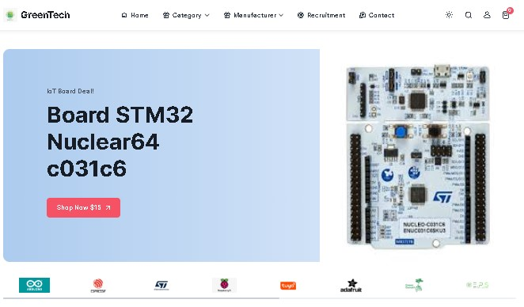
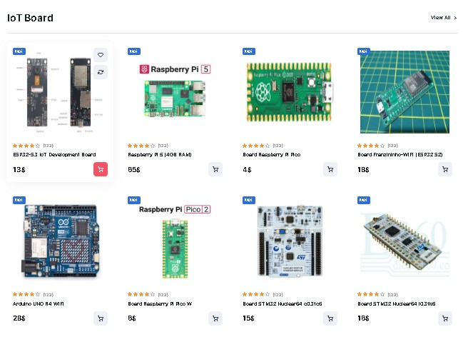
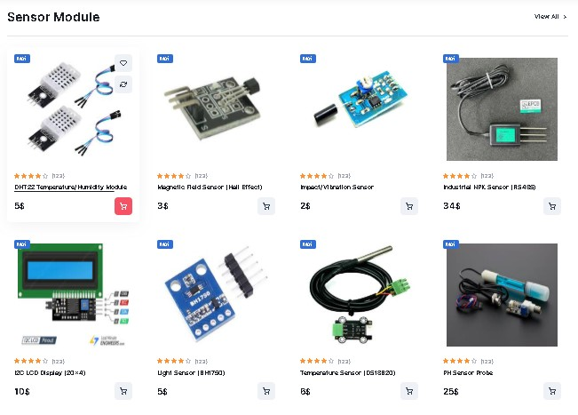
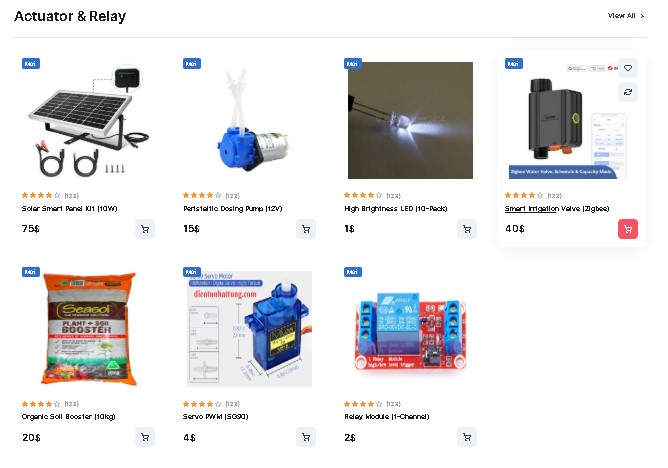
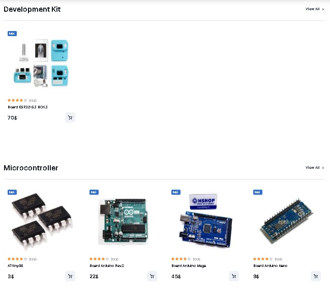
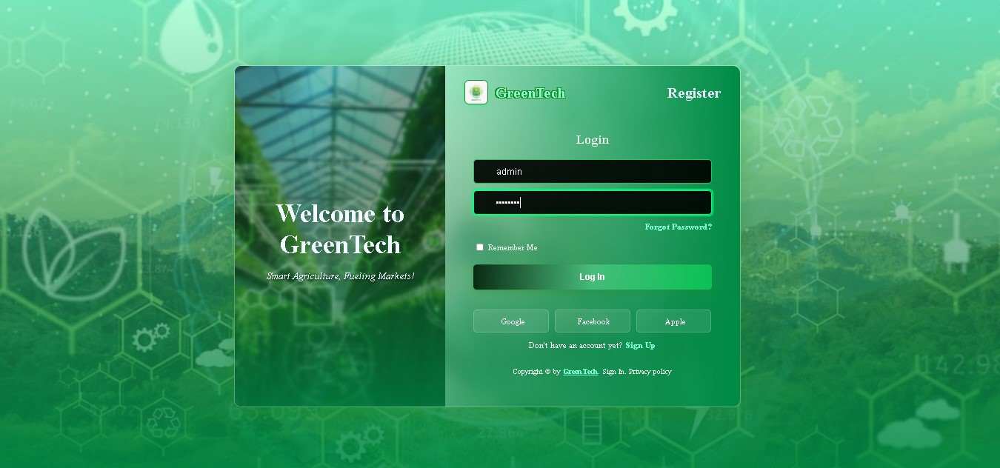
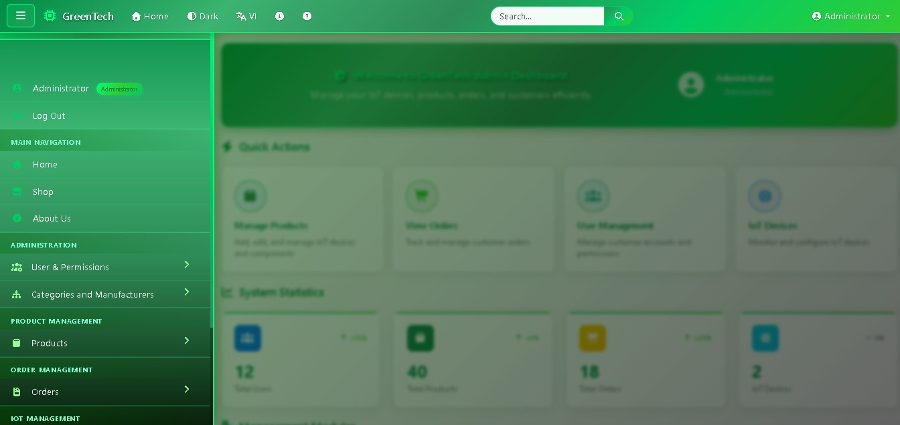

# 🛍️ GreenTech Commerce: IoT Device E-commerce Platform (Laravel)

## 💡 Project Introduction

The GreenTech Commerce project is a specialized E-commerce platform built with the Laravel Framework, focusing on the sale of Internet of Things (IoT) devices and components such as development boards (ESP Board, Arduino), sensors, and actuators. The standout feature is the integration of a Post-Sale IoT Device Management Module, which allows for modeling the monitoring of technical metrics and setting safety alert thresholds.

The goal is to provide a professional distribution channel that meets the detailed technical information requirements of technical customers and developers.

## Interface
<p align="center">
   
   
   
   
   
  <br/>
  <em>Frontend Home Page</em>
</p>

<p align="center">
   
  <br/>
  <em>Login Page</em>
</p>

<p align="center">
   
  <br/>
  <em>Register Page</em>
</p>


<p align="center">
   
  <br/>
  <em>Administrator Dashboard</em>
</p>

---

## ✨ Key Features

| Icon | Feature | Detailed Description |
|------|---------|---------------------|
| 🛒 | **Comprehensive E-commerce Flow** | Supports the entire purchasing process: Product Browsing, Cart Management, Order Placement (OrdersController), and order tracking (OrderStatuses). |
| 🛡️ | **Multi-level Security & Authorization** | 4 authorization levels: Admin, Saler (Sales), Shipper (Delivery), and Users (Customer), strictly controlled using RoleMiddleware in `app/Http/Middleware/` |
| 📊 | **Exclusive IoT Devices Management** | A module enabling Admin to register deployed IoT devices (iot_devices), define measured metrics (device_metrics), and set safety alert thresholds (alert_thresholds). |
| 📑 | **In-depth Data Management** | Separates core commercial information (products) from detailed technical specifications (product_details: CPU, RAM, Power Specs), crucial for technology products. |
| 📧 | **Automated Email Notification** | Sends automatic order confirmation emails immediately after a customer completes a transaction (using PlaceOrderSuccessEmail.php). |
| 🔄 | **Data Import/Export** | Supports bulk import and export of Product/Category/User data via Excel/CSV files using the Maatwebsite/Laravel-Excel library. |

## 🛠️ Technology Stack

The project is built on open-source technologies and modern development platforms:

| Area | Technology | Version | Notes |
|------|------------|---------|-------|
| **Back-end Core** | Laravel Framework | 10.x | The main MVC platform, optimizing performance and security. |
| **Language** | PHP | 8.2+ | Primary development language. |
| **Database** | MySQL / MariaDB | 8.0+ | Stores relational data (Products, Orders, IoT Devices). |
| **Front-end** | HTML5/CSS3, JS | Modern | Uses Blade Template Engine and the Cartzilla/Bootstrap library for the UI. |
| **Support Library** | Maatwebsite/Excel | ~3.1 | Handles Import/Export files in the Admin Dashboard. |
| **Rich Text Editor** | CKEditor 5 | N/A | Used for creating rich product descriptions. |

## 🗃️ Database Structure (Key Entity Diagram)

The database structure is designed around the core entities of Users, Products, Orders, and IoT Devices, establishing various relationships:

| Table Name | Description | Key Relationships |
|------------|-------------|-------------------|
| **users** | Stores user information, including the roles column for authorization. | 1-N with orders |
| **roles** | Defines system roles: Admin, Saler, Shipper, Users. | 1-N with users |
| **products** | Core product information (name, price, stock quantity). | N-1 with categories, manufacturers |
| **product_details** | Detailed technical specifications (CPU, RAM, Power Specs). | 1-1 with products |
| **orders** | Overall order record (total amount, address, status). | N-1 with users, order_statuses |
| **order_items** | Details of items in each order (stores price_at_order). | N-N between orders and products |
| **iot_devices** | Deployed device information (device_id, location). | 1-N with device_metrics |
| **alert_thresholds** | Safety alert thresholds (min_value, max_value) for each IoT metric. | N-1 with iot_devices |

## 📁 Project Structure (Key Directories)

The directory structure adheres to Laravel's MVC standard, supplemented by specific functional directories:

```
├── app/
│   ├── Http/
│   │   ├── Controllers/
│   │   │   ├── ...Controller.php
│   │   │   └── IoTDevicesController.php  <-- IoT device management logic
│   │   └── Middleware/
│   │       └── RoleMiddleware.php        <-- Authorization protection layer
│   ├── Models/
│   │   ├── Product.php
│   │   ├── Order.php
│   │   └── IoTDevice.php                 <-- Key Eloquent Models
│   └── Mail/
│       └── PlaceOrderSuccessEmail.php    <-- Automatic Email Template
├── database/
│   ├── migrations/                       <-- Database table schema definitions
│   └── seeders/
├── public/
│   ├── assets/                           <-- Cartzilla/Bootstrap assets
│   └── vendor/
│       └── ckeditor5/                    <-- Rich Text Editor library
├── resources/
│   └── views/
│       ├── administrator/                <-- Admin UI/CRUD
│       ├── saler/                        <-- Sales Management UI
│       ├── shipper/                      <-- Delivery Management UI
│       ├── frontend/                     <-- Customer UI (Home, Products)
│       └── user/                         <-- Personal UI (Profile, Checkout)
├── routes/
│   └── web.php                           <-- Main URL routing
└── ...
```

## ⚙️ Setup & Installation Guide

To run this project on your local machine, follow these steps:

### 1. Requirements
- PHP 8.2+
- Composer
- MySQL/MariaDB
- Web Server environment (Apache/Nginx) or integrated environment (Laragon/XAMPP)

### 2. Installation Steps

**Clone Source Code:**
```bash
git clone [your_repository_link] greentech-commerce
cd greentech-commerce
```

**Install Dependencies:**
```bash
composer install
```

**Configure Environment:**
```bash
cp .env.example .env
php artisan key:generate
```

Edit the .env file to configure your database connection:
```env
DB_CONNECTION=mysql
DB_HOST=127.0.0.1
DB_PORT=3306
DB_DATABASE=greentech-commerce # Your database name
DB_USERNAME=root
DB_PASSWORD=
```

**Run Migrations and Seed Data:**
```bash
php artisan migrate --seed
```
(This command creates tables (users, products, orders, iot_devices) and inserts sample data for roles and products)

**Create Storage Symlink:**
```bash
php artisan storage:link
```

**Start the Project:**
```bash
php artisan serve
```

The project will be accessible at: **http://127.0.0.1:8000/greentech-commerce**

## 🔑 Sample Login Credentials

Use the following accounts to test the multi-level system:

| Role | Username | Password | Access Area |
|------|----------|----------|-------------|
| **Administrator** | admin | password | Full system management (User, Order, IoT Config) |
| **Saler (Sales)** | fengshuiying | password | Product, Category, Order Status updates |
| **Shipper (Delivery)** | linsiruip | password | Orders in Shipping status management |
| **Customer (User)** | yuzhangyou | password | Homepage, Ordering, Personal Profile |

## 🚀 Getting Started

After installation, you can:

1. **Browse Products**: Visit the homepage to view available IoT devices and components
2. **Add to Cart**: Select products and manage your shopping cart
3. **Place Orders**: Complete the checkout process with automated email notifications
4. **IoT Management**: (Admin only) Configure and monitor deployed IoT devices
5. **Import/Export**: (Admin only) Bulk manage product data via Excel/CSV

## 📞 Support

For technical support or questions about the IoT integration features, please refer to the project documentation or contact the development team.

---

**GreenTech Commerce** - Professional IoT Device Distribution Platform